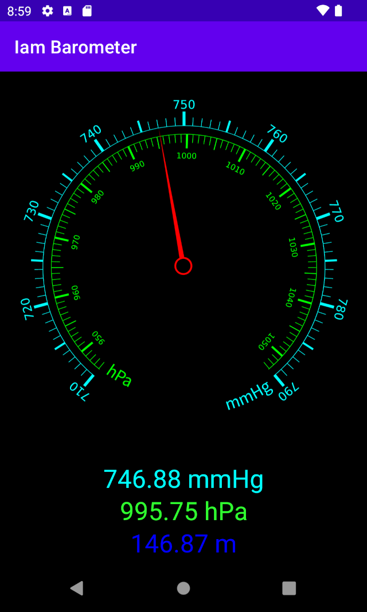

# Shortly

Some Android devices have a barometer sensor on board. I have one such device and wanted an application which could show hPa, mmHg and approximate altitude in meters over the sea. So developed a small one.

Because it has been developed for my own purposes, I have not published it into the Play store. It can be downloaded only as [pre-built APK for Android 12+](https://github.com/raydac/iam-barometer/releases/tag/1.0.0-S). 
